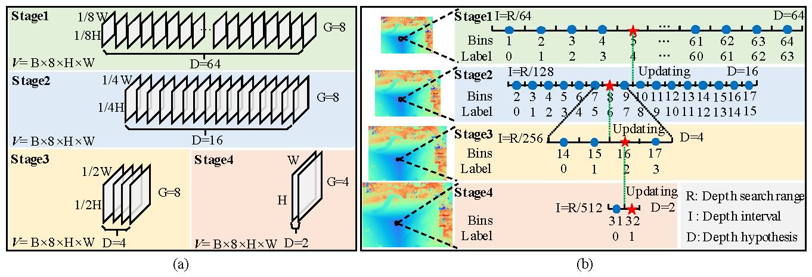
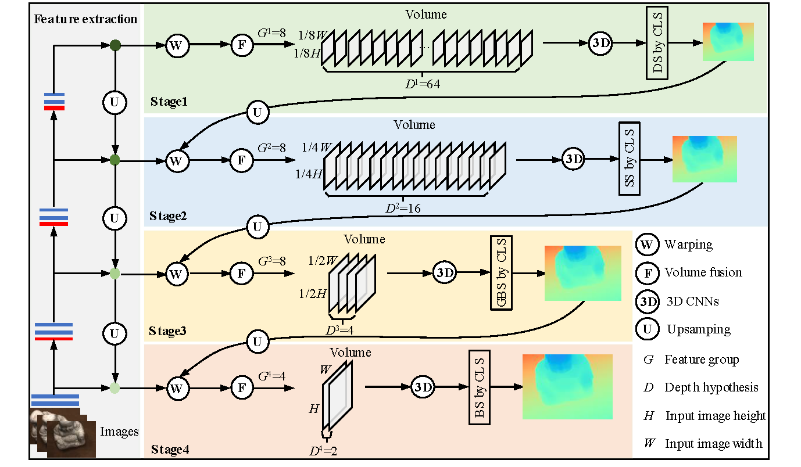

<!-- <br />

<div align="center">
  <h1 align="center">ICV-Net: Identity Cost Volume Network for Multi-View Stereo Depth Inference</h1>
  <p align="center">
    <a href="https://orcid.org/0000-0002-3634-0299">Pengpeng He<sup>1</sup></a>,
    Yueju Wang<sup>2</sup></a>,
    Yong Hu<sup>1</sup></a>,
    Wei, He<sup>1</sup></a>
    <br />
    1 Wuhan University of Technology; 2 Wuhan University
    <br />
    <br />
    <br />
  </p>

</div> -->


# ICV-Net: Identity Cost Volume Network for Multi-View Stereo Depth Inference

## Introduction

This is the official pytorch implementation of our paper: ICV-Net: Identity Cost Volume Network for Multi-View Stereo Depth Inference. In this work, we first propose novel identity cost volumes with the identical cost volume size at each stage, which dramatically decreases memory footprint while clearly improving depth prediction accuracy and inference speed. The depth inference is then formulated as a dense-to-sparse search problem that is solved by performing a classification to locate predicted depth values. Specifically, in the first stage, a dense linear search is adopted to calculate an initial depth map. The depth map is then refined by sampling a smaller number of depth hypotheses in the following two stages. In the final stage, we exploit a binary search with only two depth hypotheses to obtain the final depth map. Combining identity cost volumes with the dense-to-sparse search strategy, we propose an identity cost volume network for MVS, denoted as ICV-Net. The proposed ICV-Net is demonstrated on competitive benchmarks. Experiments show our method can reduce dramatically the memory consumption and extend the learned MVS to higher resolution scenes. 



## Pipeline



## Installation

Clone repo:
```
git clone https://github.com/hepengpeng/ICVNet.git
cd ICVNet
```

The code is tested with Python == 3.8, PyTorch == 1.11.0 and CUDA == 11.3 on NVIDIA GeForce RTX 3090. We recommend you to use [anaconda](https://www.anaconda.com/) to manage dependencies. You may need to change the torch and cuda version in the `requirements.txt` according to your computer.
```
conda create -n icvnet python=3.8
conda activate icvnet
pip install -r requirements.txt
```

## Datasets

### DTU

Download the [DTU dataset](https://drive.google.com/file/d/1eDjh-_bxKKnEuz5h-HXS7EDJn59clx6V/view) pre-processed by [MVSNet](https://github.com/YoYo000/MVSNet) and extract the archive. You could use [gdown](https://github.com/wkentaro/gdown) to download it form Google Drive. You could refer to [MVSNet](https://github.com/YoYo000/MVSNet) for the detailed documents of the file formats.

Download the original resolution [depth maps](https://drive.google.com/open?id=1LVy8tsWajG3uPTCYPSxDvVXFCdIYXaS-) provided by [YaoYao](https://github.com/YoYo000/MVSNet/issues/106). Extract it and rename the folder to `Depths_raw`. 

Download the original resolution `Rectified` [images](http://roboimagedata2.compute.dtu.dk/data/MVS/Rectified.zip) from the [DTU website](https://roboimagedata.compute.dtu.dk/?page_id=36). Extract it and rename the folder to `Rectified_raw`. 

Merge the three folders together and you should get a dataset folder like below:

```
dtu
├── Cameras
├── Depths
├── Depths_raw
├── Rectified
└── Rectified_raw
```

### BlendedMVS

Download the [low-res set](https://1drv.ms/u/s!Ag8Dbz2Aqc81gVDgxb8MDGgoV74S?e=hJKlvV) from [BlendedMVS](https://github.com/YoYo000/BlendedMVS). Extract the file and you should get a data folder like below:

```
BlendedMVS
└── low_res
```

### Tanksandtemples

Download the [Tanks and Temples testing set](https://drive.google.com/open?id=1YArOJaX9WVLJh4757uE8AEREYkgszrCo) pre-processed by [MVSNet](https://github.com/YoYo000/MVSNet). For the `intermediate` subset, we use the long range cameras instead of those in `short_range_caemeras_for_mvsnet.zip` in the `intermediate` folder, see [here](https://github.com/YoYo000/MVSNet/issues/14). You should get a dataset folder like below:

```
tankandtemples
├── advanced
│   ├── Auditorium
│   ├── Ballroom
│   ├── Courtroom
│   ├── Museum
│   ├── Palace
│   └── Temple
└── intermediate
    ├── Family
    ├── Francis
    ├── Horse
    ├── Lighthouse
    ├── M60
    ├── Panther
    ├── Playground
    └── Train
```

## Configure

We use [yaml](https://yaml.org/) file to set options in our codes. Several key options are explained below. Other options are self-explanatory in the codes. Before running our codes, you may need to change the `true_gpu`, `data: root_dir` and `model_path` (only for testing).

* `output_dir` A relative or absolute folder path for writing logs, depthmaps.
* `true_gpu` The true GPU IDs, used for setting CUDA_VISIBLE_DEVICES in the code. You may change it to your GPU IDs.
* `gpu` The GPU ID used in your experiment. If true_gpu: "5, 6". Then you could use gpu: [0], gpu: [1], or gpu: [0, 1]
* `max_depth` Max depth of the binary tree in the code, same as the `stage` number described in our paper. For historical reasons, the `stage` number in the code means the number of 3D networks.
* `model_path` The checkpoint file path used for testing.
* `stage_num` The number of 3D networks.
* `depth2stage` The correspondence between iterations and 3D networks.
* `data: root_dir` A relative or absolute folder path for training or testing data. In order to successfully run the codes, you may need to change it to your data folder.
* `fusion: output_dir` A relative or absolute folder path for writing point clouds.

## Training

Train the model on DTU dataset
```
python train_icvnet.py --cfg configs/train_dtu.yaml
```

Train the model on BlendedMVS dataset
```
python train_icvnet.py --cfg configs/train_blended.yaml
```

## Testing

We have provided two checkpoints in the `ckpt` folder. You could use `test_gbinet.py` to reconstruct depthmaps and point clouds with these checkpoints. To reproduce the DTU results in our paper, run commands below:

```
python test_icvnet.py --cfg configs/test_dtu.yaml
```
After you get the point clouds, you could follow the instructions in [DTU](http://roboimagedata.compute.dtu.dk/?page_id=36) website and also the [PatchmatchNet](https://github.com/FangjinhuaWang/PatchmatchNet) to quantitatively evaluate the point clouds.

To reproduce the Tanksandtemples results in our paper, run commands below:
```
python test_icvnet.py --cfg configs/test_tanks_intermediate.yaml
```
```
python test_icvnet.py --cfg configs/test_tanks_advanced.yaml
```
After you get the point clouds, you could submit them to the [Tanksandtemples](https://www.tanksandtemples.org/) website for quantitative evaluatation.

<!-- LICENSE -->

## License

Our code is distributed under the MIT License. 

## Contact

If you have any questions, please raise an issue or email to Pengpeng He (`hepengpengemail@163.com`).

## Acknowledgments

Our code is mostly migrated from [GBi-Net](https://github.com/MiZhenxing/GBi-Net),  but we embed two innovative components, identity cost volumes and dense-to-sparse search by classification. We also  follows several awesome repositories. We appreciate them for making their codes available to public.

* [GBi-Net](https://github.com/MiZhenxing/GBi-Net)
* [CasMVSNet](https://github.com/alibaba/cascade-stereo/tree/master/CasMVSNet)
* [CasMVSNet_pl](https://github.com/kwea123/CasMVSNet_pl)
* [MVSNet](https://github.com/YoYo000/MVSNet)
* [MVSNet_pytorch](https://github.com/xy-guo/MVSNet_pytorch)
* [PatchmatchNet](https://github.com/FangjinhuaWang/PatchmatchNet)
* [PointMVSNet](https://github.com/callmeray/PointMVSNet)
* [UCSNet](https://github.com/touristCheng/UCSNet)

